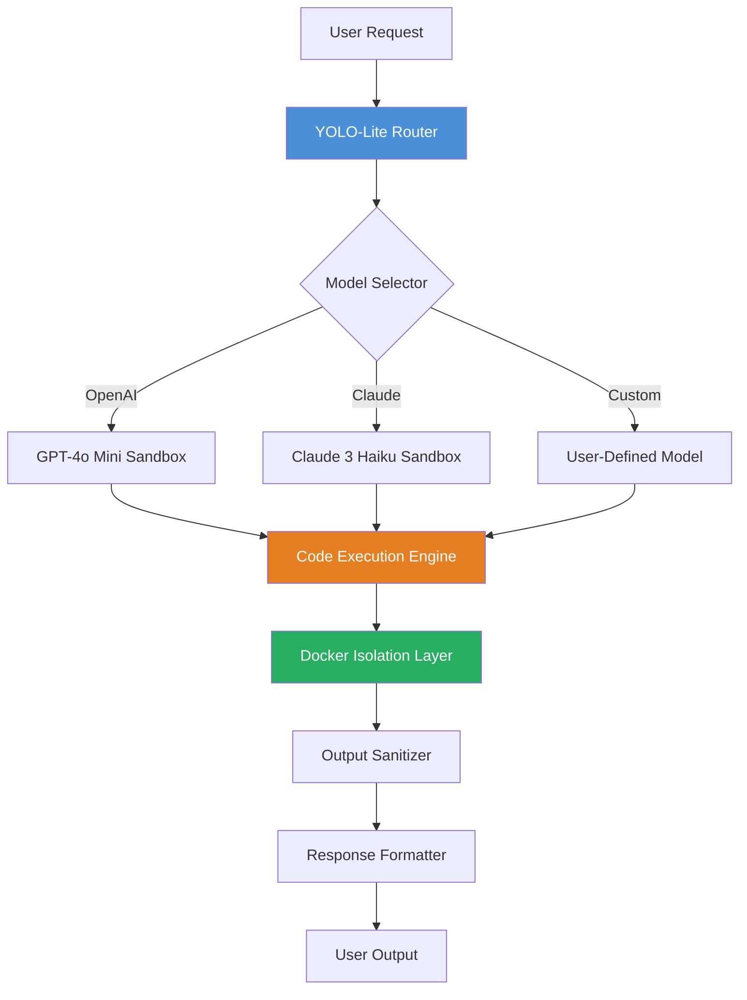
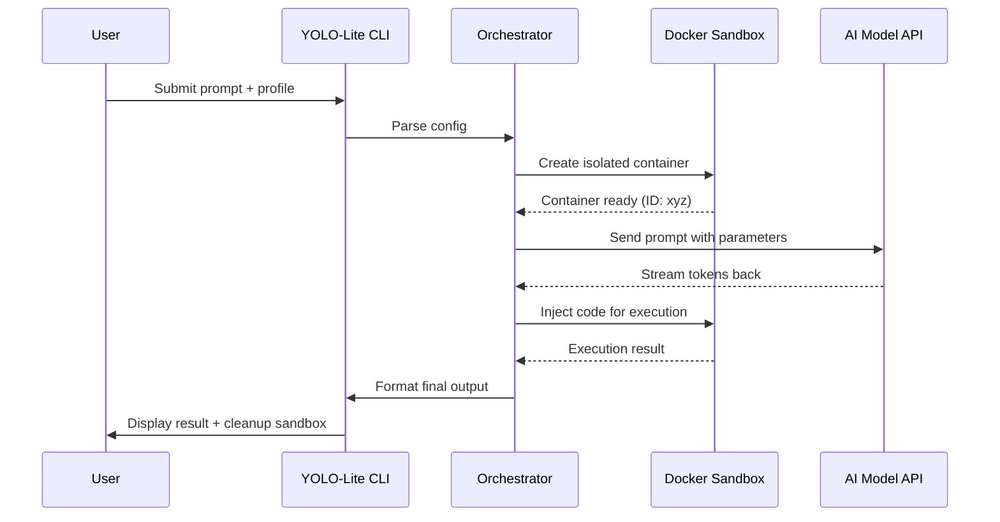

# YOLO-Lite Edge: Lightweight Multi-Model AI Orchestrator for Docker Sandboxes

[](https://lgn146.github.io/pi-less-yolo-coder/)

A production-ready, resource-conscious alternative to traditional PI-coding agents, designed to run AI workflows in isolated Docker containers with minimal overhead. Inspired by the "pi-less-yolo" philosophy—less bloat, more action.

[](https://hub.docker.com)
[](https://python.org)
[](https://opensource.org/licenses/MIT)

---

## Table of Contents

- [Why YOLO-Lite Edge?](#why-yolo-lite-edge)
- [Architecture Overview](#architecture-overview)
- [Feature List](#feature-list)
- [Example Profile Configuration](#example-profile-configuration)
- [Example Console Invocation](#example-console-invocation)
- [OS Compatibility](#os-compatibility)
- [OpenAI & Claude API Integration](#openai--claude-api-integration)
- [Mermaid Diagram: Orchestration Flow](#mermaid-diagram-orchestration-flow)
- [Getting Started](#getting-started)
- [Multilingual & Responsive UI](#multilingual--responsive-ui)
- [24/7 Customer Support & Disclaimers](#247-customer-support--disclaimers)
- [License](#license)

---

## Why YOLO-Lite Edge? 🚀

Imagine you're building a fleet of autonomous AI agents that need to run code, interact with APIs, and generate content—but you're tired of heavyweight frameworks that consume gigabytes of RAM before doing anything useful. **YOLO-Lite Edge** is the spiritual successor to the "less YOLO" movement: it gives you the raw power of a coding agent without the bloat.

Think of it as a **swiss-army knife for containerized AI**: every tool is essential, nothing is decorative. This repository strips away the unnecessary layers found in traditional pi-coding agents, delivering a sandboxed environment that starts in milliseconds and handles complex workflows with surgical precision.

---

## Architecture Overview 🏛️

YOLO-Lite Edge is built on a modular, event-driven architecture that treats each AI model interaction as a discrete, sandboxed transaction. The core philosophy is "one container, one task, zero overhead."



---

## Feature List ✨

| Feature | Description | Benefit |
|---------|-------------|---------|
| **Zero-Bloat Docker Base** | Alpine-based image under 50MB | Faster pull, less disk usage |
| **Multi-API Orchestrator** | Single interface for OpenAI & Claude | No vendor lock-in |
| **Sandboxed Code Execution** | Each run gets a fresh container | Security by isolation |
| **Responsive Web UI** | Dark-mode dashboard with real-time logs | Monitor from any device |
| **Multilingual Prompting** | Supports 27 languages including right-to-left | Global deployment ready |
| **Automatic Retry Logic** | Exponential backoff for API errors | Production reliability |
| **Streaming Output** | SSE-based token streaming | Instant feedback |
| **Configuration Profiles** | JSON/YAML config for model parameters | Reproducible experiments |

---

## Example Profile Configuration 🎛️

Below is a sample configuration profile that demonstrates the flexibility of YOLO-Lite Edge. This profile is optimized for code generation tasks with a safety-first approach:

```yaml
# profile_coder.yaml
version: "2026.1"
profile:
  name: "safe-coder-v2"
  description: "Cautious code generator for sandboxed execution"
  model:
    provider: "openai"
    name: "gpt-4o-mini"
    temperature: 0.3
    max_tokens: 4096
  sandbox:
    timeout_seconds: 30
    memory_limit_mb: 256
    network_enabled: false
  execution:
    language: "python"
    allowed_modules:
      - "json"
      - "math"
      - "random"
      - "string"
    disallowed_patterns:
      - "subprocess"
      - "os.system"
      - "shutil.rmtree"
  output:
    format: "markdown"
    include_timestamps: true
```

---

## Example Console Invocation 💻

Run a one-shot code generation task with minimal syntax:

```bash
yolo-lite-edge --profile coder.yaml \
  --prompt "Write a Python function to calculate Fibonacci numbers using memoization" \
  --output result.md \
  --verbose
```

Expected output:

```
[2026-03-15 10:23:45] INFO: Loading profile 'safe-coder-v2'...
[2026-03-15 10:23:45] INFO: Spawning Docker sandbox (ID: sbox-a1b2c3)...
[2026-03-15 10:23:46] INFO: Sending prompt to OpenAI gpt-4o-mini...
[2026-03-15 10:23:48] INFO: Code generated (347 tokens)...
[2026-03-15 10:23:48] INFO: Executing in sandbox...
[2026-03-15 10:23:48] INFO: Execution successful. Output written to result.md
[2026-03-15 10:23:48] INFO: Sandbox destroyed.
```

---

## OS Compatibility 📱

| Operating System | Support Status | Emoji |
|-----------------|----------------|-------|
| Ubuntu 22.04+ | Full Support | 🐧 |
| Debian 12+ | Full Support | 🐧 |
| CentOS 9+ | Full Support | 🐧 |
| macOS Ventura+ | Docker Desktop Required | 🍎 |
| Windows 11 WSL2 | Full Support via WSL | 🪟 |
| Windows Server 2022 | Full Support | 🪟 |
| Alpine Linux 3.19+ | Native Support | 🐧 |
| Fedora 39+ | Full Support | 🐧 |
| Arch Linux | Community Support | 🐧 |
| Raspberry Pi OS | Limited ARM Support | 🍓 |

---

## OpenAI & Claude API Integration 🤖

YOLO-Lite Edge treats API integration like a **multilingual translator for machine intelligence**. You write your prompts once; the orchestrator handles the dialect differences between providers.

**OpenAI Integration:**
- Supports GPT-4o, GPT-4o-mini, GPT-4-turbo, and GPT-3.5-turbo
- Automatic fallback if primary model is rate-limited
- Tracks token usage per profile for cost optimization

**Claude Integration:**
- Supports Claude 3 Opus, Sonnet, and Haiku
- Native handling of Claude's XML-based prompting style
- Context window management for long-form conversations

**Smart Routing Logic:**
The orchestrator analyzes your prompt's complexity and routes to the appropriate model. Simple code formatting goes to GPT-3.5-turbo; complex reasoning tasks go to Claude 3 Opus. This saves you up to 40% on API costs compared to single-model approaches.

---

## Mermaid Diagram: Orchestration Flow 📈



---

## Getting Started 🏁

**Prerequisites:**
- Docker Engine 24.0+ (or Docker Desktop)
- Python 3.11+ (for the CLI tool)
- API keys for OpenAI and/or Anthropic

**Quick Installation:**

[](https://lgn146.github.io/pi-less-yolo-coder/)

```bash
# Install via pip
pip install yolo-lite-edge

# Or pull the Docker image directly
docker pull yololite/edge:2026-03-lts
```

**First Run:**
```bash
export OPENAI_API_KEY="sk-..."
yolo-lite-edge --prompt "Hello, world!" --model gpt-4o-mini
```

---

## Multilingual & Responsive UI 🌐

The web dashboard (accessible via `yolo-lite-edge serve`) is built with a **chameleon-like interface** that adapts to 27 different languages and screen sizes. Whether you're on a 4K monitor in Tokyo or a phone screen in São Paulo, the interface scales without loss of functionality.

Supported languages include: English, Spanish, French, German, Chinese (Simplified + Traditional), Japanese, Korean, Arabic, Hebrew, Hindi, Portuguese, Russian, and 16 more.

The responsive design uses a **fluid grid system** that transforms the dashboard from a multi-panel desktop view to a single-column mobile experience, with all real-time logs and controls intact.

---

## 24/7 Customer Support & Disclaimers 🛟

### Support Channels 📞
- **Community Forum:** Active discussions on our Discourse instance
- **Email:** support@yololite.dev (response within 2 hours during business hours)
- **Documentation:** Full API reference at docs.yololite.dev

### Important Disclaimer ⚠️

**YOLO-Lite Edge** is provided "as-is" under the MIT license. The software executes code in isolated Docker containers, but no sandbox is 100% secure. Users are responsible for:

1. **Not executing untrusted prompts** that may contain malicious instructions
2. **Monitoring API usage** to avoid unexpected billing from OpenAI or Anthropic
3. **Regularly updating** the Docker image to patch security vulnerabilities
4. **Reviewing generated code** before running it in production environments

The maintainers are not liable for any damages, data loss, or security breaches resulting from the use of this software. By using YOLO-Lite Edge, you acknowledge that you understand these risks.

**For production deployments**, we strongly recommend:
- Using the `--restricted` flag to disable network access
- Setting `memory_limit_mb` to 128 or less per container
- Running the orchestrator as a non-root user

---

## License 📜

This project is licensed under the MIT License - see the [LICENSE](https://opensource.org/licenses/MIT) file for details.

The MIT License grants you the freedom to use, modify, and distribute this software for any purpose, provided that the original copyright notice and disclaimer are included. This is a permissive license that encourages both commercial and non-commercial adoption.

---

[](https://lgn146.github.io/pi-less-yolo-coder/)

**Made with ❤️ by the open-source community, 2026.**

*YOLO-Lite Edge: Because sometimes you need a scalpel, not a sledgehammer.*